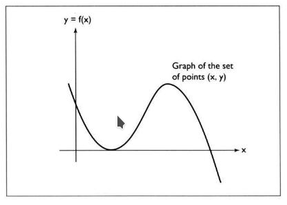
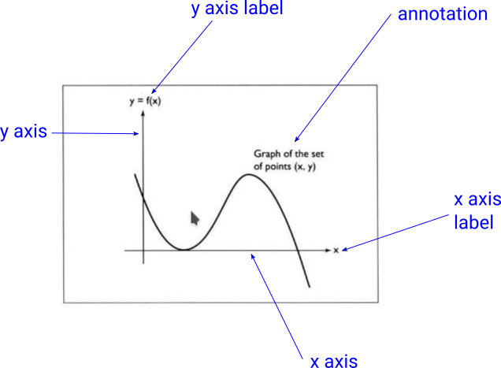

#### The Function

In mathematics and engineering we often use formulas like $y = x^3$. 

In words, this is read "y equals x cubed."

You will see expressions like $y = x^3$ written in a more general form as $y = f(x)$.

In words, this is read "y equals f of x."  In slightly less formal words, we can also read this as "y is a function of x."

In this example, $f(x)$ (read: "f of x") is meant to stand for $x^3$ (read: x cubed).

The idea is that we can "plug in" some value of $x$ into $f(x)$, and $f(x)$ will compute a value of $y$. 

We might draw a graph of this function by varying x from perhaps -0.1 to 1, and calculating all the corresponding $y$ values, and then drawing all the resulting $(x, y)$ pairs as points connected to one another with line segments, resulting in a graph like the following:

We  call $y$ the ***dependent variable***, since it depends on $x$. And we call $x$ the ***independent variable***, since it depends on nothing.

Here are the elements of the graph shown:

 	

ASSIGNMENT: Your assignment is to create a graph approximately like this one, in JGlut.

