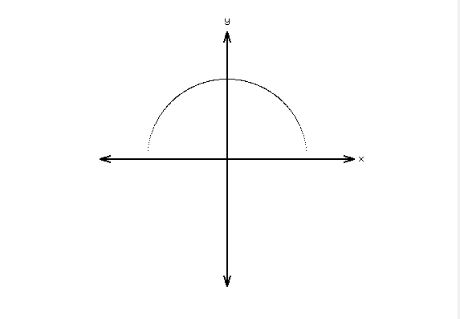

#### Explicit Form

We saw last time that we could draw a function $y=f(x)$ by varying x from perhaps -0.1 to 1, and calculating all the corresponding $y$ values, and then drawing all the resulting $(x, y)$ pairs as points joined together by line segments, resulting in a graph like the following:

This form of the function is called the ***explicit form***, meaning that there is an explicit solution because each y can be written as a (dependent) variable who's value is computed from a value of the x (independent) variable. 

For example here is the (explicit) point/slope form of a line:

$$y=mx+b$$

Where $m$ is the slope, and $b$ is the y-intercept. Both $m$ and $b$ are constants.

For another example, here is the (explicit) form of a simple cubic function:

$$y=x^3$$

#### Implicit Form

Some equations may are not easily written in explicit form. For example, the equation of a circle of radius 1, centered at the origin is:

$$x^2+y^2=1$$

or (subtracting 1 from both sides of the equation):

$$x^2+y^2-1=0$$

When written in this way, we say that the function is written in ***implicit form***, meaning that there's a solution implicit in the equation, but we can't say which variable is dependent and which is independent, so there's no way to compute a solution to one from the other. 

You may have already realized that we can re-write this equation so that y is a function of x:

$$y=\pm\sqrt{1-x^2}$$

Surely this is explicit form, isn't it?

Well, yes and no.

It's explicit form, but it is not explicit form of ***a*** function.

It is actually shorthand for the explicit form of two functions:

$$y=\sqrt{1-x^2}$$

and

$$y=-\sqrt{1-x^2}$$

Okay, well that's not so bad, at least we can write code to draw $y=\sqrt{1-x^2}$ curve fairly easily, can't we?

When we do, we hope it will look something like this:

ASSIGNMENT: Your assignment is to create a graph approximately like this one, in JGlut