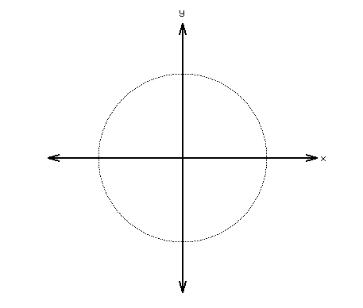
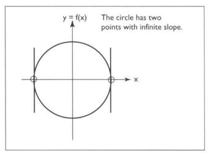

#### Limitations of Explicit Form

We were trying to graph a circle using explicit form.  We were really hoping it'd end up looking like this:

Rather than attempt the whole circle, we drew just the upper half.

Hopefully, it looked something like this:

Do you notice that it kind of looks like the semi-circle didn't quite get fully drawn?

You're seeing an artifact of the fact that there is an infinite slope at two points on the circle:

Let's go back to the original equation of a circle in implicit form:

$\begin{align}
x^2+y^2=1\tag{Lesson003.1}
\end{align}$

What if we could find a way to make both x and y a function of an entirely different variable instead of having y be a function of x? 

Instead of the implicit or explicit form, we'd have something like this:

$\begin{align}
f(t) + g(t) = 1\tag{Lesson003.2}
\end{align}$

Thinking in terms of trigonometry, can you remember (or look up) a trigonometric formula that kind of looks like the one in equation $(Lesson0003.1)$ above?

How about one that looks like this?

$$\begin{align}
f^2(\theta) + g^2(\theta) = 1\tag{Lesson003.3}
\end{align}$$

How about this?

$$\begin{align}
\cos^2\theta + sin^2\theta = 1\tag{Lesson003.4}
\end{align}$$

What if I put the equations $(Lesson003.1)$ and $(Lesson003.4)$ side by side:

$$x^2+y^2=1$$

$$\cos^2\theta + \sin^2\theta=1$$

Can you see that:

$$x^2 = \cos^2\theta$$

and

$$y^2=\sin^2\theta$$

Can you also see that we can take the square root of both sides of both equations and get this?

$$x = \pm\cos\theta$$

and

$$y=\pm\sin\theta$$

where $0 \le \theta < 2\pi​$

ASSIGNMENT: Your assignment is to write OpenGL code to draw a circle using these new formulae:

