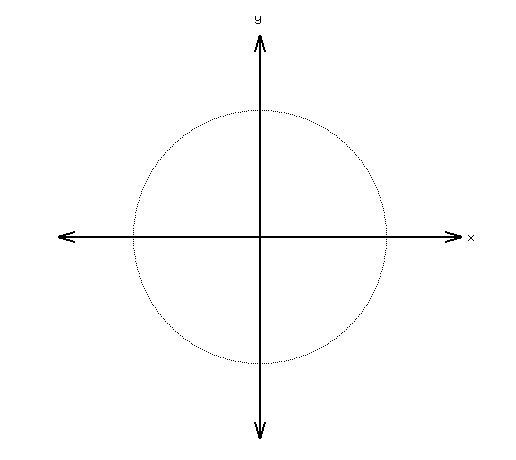
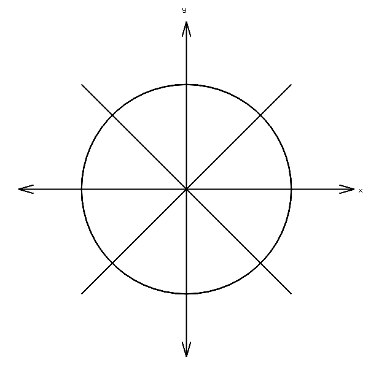

#### The parametric form

Hopefully, you've got something that looks like a circle again:

Eventually, we're going to revisit the three different ways to make a circle, and figure out which is the best, but for now I want you to realize that parametrization is not unique.  There may be many ways to represent a particular geometry, some more efficient than others.

I also want to make the point that some of the most efficient ways to represent geometry is to use a parametrization involving ***polynomials***.

A polynomial $p(t)$ is a function that  is of the following form:

$$p(t)=a_0t^0+a_1t^1+a_2t^2+a_3t^3+...+a_nt^n$$

which can also be written as

$$p(t)=\sum\limits_{i=0}^na_it^i$$

where $0\le n\le \infty$

The set $\{a_0, a_1, a_3, ..., a_n\}$ are constants, each potentially with a different value. This set of constants is called the set of ***coefficients*** of the polynomial.

The set $\{t^0, t^1, t^2, t^3, ..., t^n\}$ are called the ***basis functions*** of the polynomial. 

This is not the only way to represent a polynomial, There can be different basis functions. What's important is that you remember that this particular set is called the set of ***power basis functions***.

Remember the two functions we used most recently to draw a circle?

$$x=\frac{1-t^2}{1+t^2}$$

$$y = \frac{2t}{1+t^2}$$

Do you see that the right-hand-side of each equation is a ratio?

Do you recognize that the right-hand-side of each equation is a ratio of particular power basis functions, with particular coefficients?

What is the coefficient of $2t$?

What is the power basis function of $2t$? 

Whenever you see a ratio of two polynomials, you can call it a ***rational polynomial function***. The word rational here is composed of two sub-words: ratio-nal .  This means the condition of something being a ratio. In our case, it is a ratio of (two) polynomials.

Sometimes we refer to rational polynomial functions as ***rational functions*** or ***rational polynomials***, but only when there is enough context to infer the missing word.

ASSIGNMENT: You may have noticed that your circle looks kind of ragged.  Find a way to make your circle (based on the two rational polynomials) appear nice and smooth:

