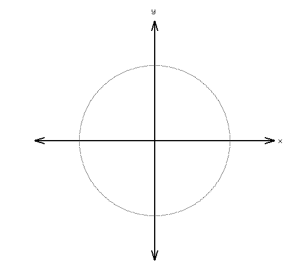

#### The parametric form

Here's the "before" picture:

And here's the "after" picture:

I'll admit that the difference is pretty subtle. The circle looks generally a little thicker.

The crossed lines are actually there as reference to show what a line looks like at various angles.  This is $\pm\pi\over4$.

We'll come back to the topic of "smoothing" later.

It is often useful to consider parametric form as a representation of position $(x, y)$ as a function of time $(t)$.  This idea becomes very useful when we consider different parametrization for different purposes.

ASSIGNMENT: Using the $x=\cos \theta, y=\sin \theta$ parametrization, create an OpenGL animation showing the motion of a particle (a point) as it follows the path of the parametrization over time.  i.e. $\theta = t$.

