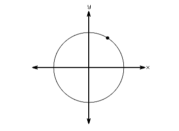

#### The parametric form

Here's a snapshot of the particle moving:

Notice that using the $x =\cos(t), y = \sin(t)$ parametrization, the motion of the particle around the circle is uniform.

ASSIGNMENT: To make this point even more clearly, this lesson's assignment is to make an SWT application with an embedded OpenGL viewport which resembles this:

By default, the Animate checkbox is unchecked, and you may use the scale control to move the position of the "particle" around the circle and graphs.  Notice that the equations and numeric coordinates all update in real-time.

If the Animate checkbox is checked, the graphs will all update in real-time, matching the motion of the particle around the circle.  When the Animate checkbox is checked, the scale control is disabled.

Note: You should use jlatexmath to render the equations as bitmaps.